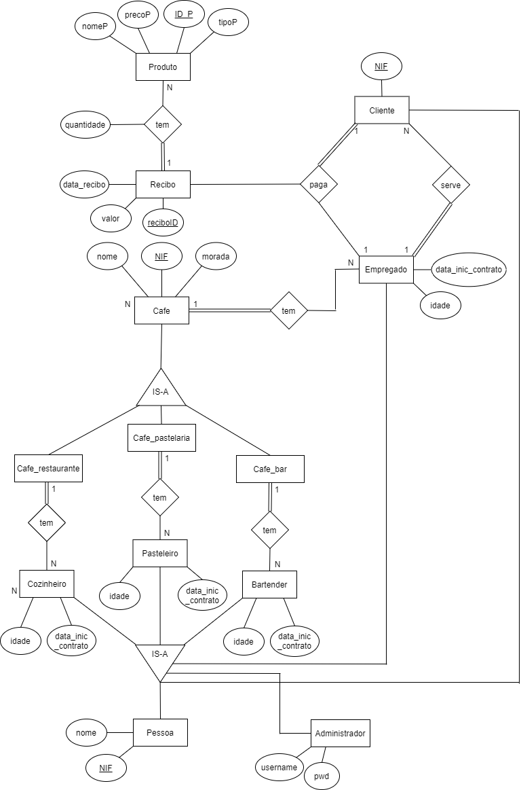
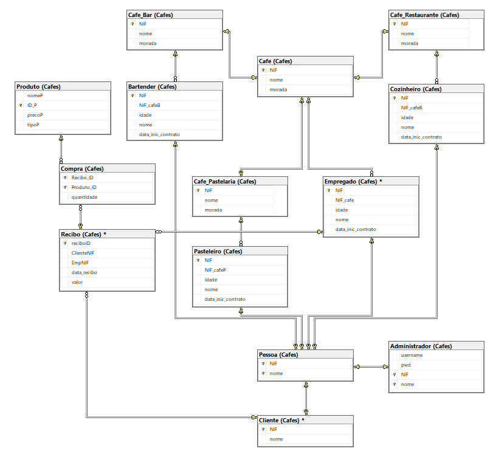

# BDProject

The objective of this project was to create a **coffee management system**, with special importance in the development of the **database** for the system.

## Course
This project was developed under the [Databases](https://www.ua.pt/en/uc/2238) course of [University of Aveiro](https://www.ua.pt/).

## Admin accounts
This are the predefined **admin accounts**:
* Username: **profBD**; Password: **BD2020**
* Username: **didi**; Password: **123**
* Username: **dudu**; Password: **321**
* Username: **quimf**; Password: **nice934**

## Entity-Relationship Diagram

    

## Relational Schema

    

## Authors
* **Diogo Moreira**: [diogoemoreira](https://github.com/diogoemoreira)
* **Eduardo Santos**: [eduardosantoshf](https://github.com/eduardosantoshf)